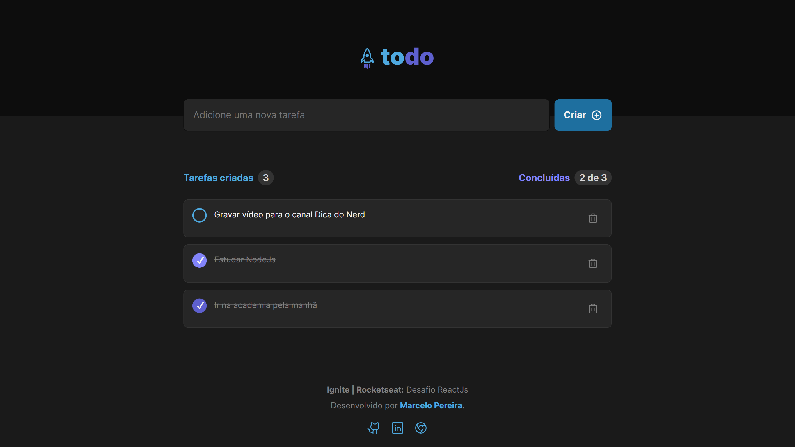

# Todo List - Ignite | Rocketseat: Desafio ReactJs

## Sobre o projeto

Essa aplicação foi desenvolvida para o Ignite | Rocketseat: Desafio ReactJs. Trata-se de uma aplicação web (SPA) desenvolvida com ReactJs que possibilita o usuário cadastrar tarefas, marcar estas como realizadas ou removê-las.

## Tecnologias

- ReactJs
- Vite
- TypeScript
- CSS Module
- Phosphor Icons
- Vercel

## Deploy

Este projeto foi publicado na **_Vercel_**. 

[https://ignite-todo-list.marcelopereira.dev](https://ignite-todo-list.marcelopereira.dev)
